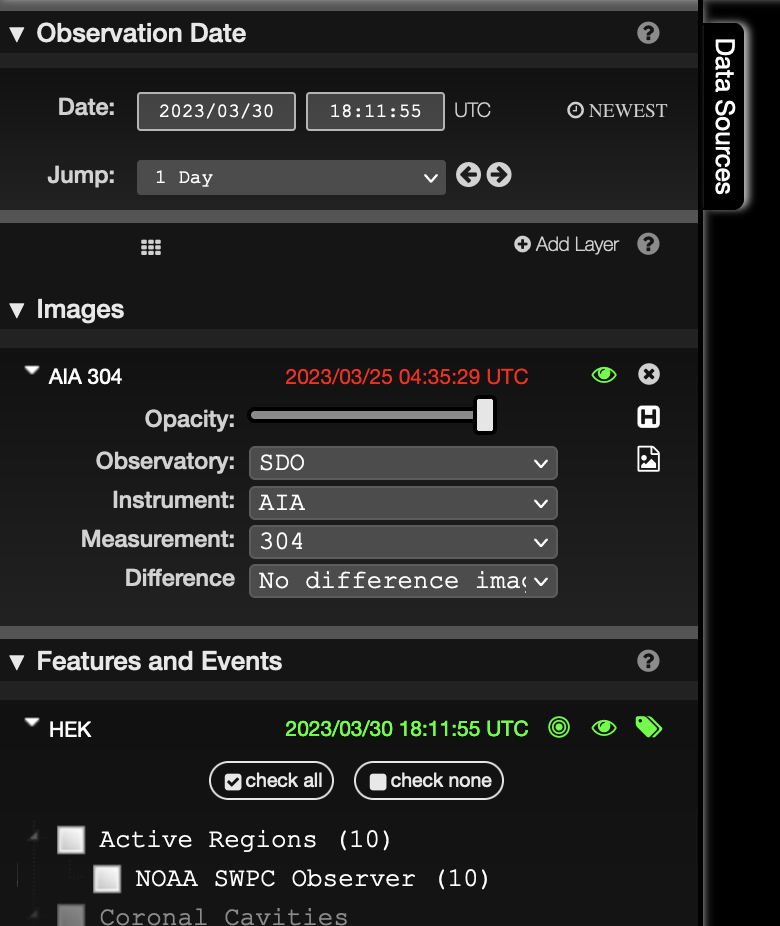
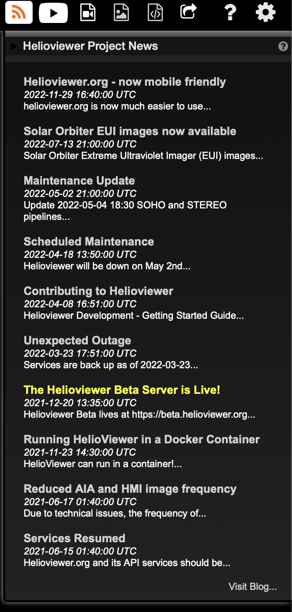

[Helioviewer.org][hvorg] is a browser-based solar and heliospheric data visualization application. With it you overlay and visualize data from multiple sources - observational data acquired by space- and ground- based instrumentation, feature and event information and data on other selected solar system celestial bodies. You can also make and share images and movies of what you see, and obtain the source scientific data for your own research.

# I found a bug / I need help / I have a question / I have an idea
If you have found a bug, need help with using helioviewer.org,  have a
question about it, or have an idea about how to improve it, please
[email us][hvpnemail] or [file an issue on the project repository][hvp].

# How to use helioviewer.org

## Overview
When opened for the first, helioviewer.org shows a default selection of images closest to the current Universal Coordinated Time (UTC). All times shown in helioviewer.org are in UTC time.

Different times and different types of data can be selected by clicking on the "Data Sources" tab on the left.

A drawer will pop-up that allows you to change the time (Observation time), the image shown (Images), information about solar features and events (Features and Events) and other aspects of the state of the solar system (Celestial Bodies).

Each of these can be opened to make selections.

When you have selected your data sources, you can use the buttons

to re-center the view on the center of the Sun, and to zoom out and zoom in. Clicking and dragging your mouse in the viewer window pans the view.

On the bottom the tab

opens up a time line viewer, showing the number and timing of the images and features/events you have selected. The time line also has a zoom in/out capability, and clicking and dragging with the mouse allows you to examine different times.

In the upper left there are a number tools:

that provide more functionality to the application.  The first two

allow you to add a scale to the viewer window, either in terms of the size of the Earth or in kilometers.  Announcements concerning the Helioviewer Project are accessible here:

shown here in its open configuration. The remaining tools allow you to

| Icon | Function |
|:----------|:----------|
|             | view movies made by other users and shared to YouTube |
|     | create and share movies |
|               | take a screenshot |
|         | obtain data and data scripts |
|          | create a link to share your view |
|            | get help on helioviewer.org |
|   | change settings on helioviewer.org |

## Opening videos in JHelioviewer

To open a movie in JHelioviewer, first have JHelioviewer running, then open one of your movies in [helioviewer.org](https://helioviewer.org).

In the bottom right of the movie player window you will see an "Open in JHelioviewer" button.

If JHelioviewer is not running, the button will say "JHV is not open”, and the button will not be clickable. Make sure to open JHelioviewer first.

When you click the button, JHelioviewer will display a notification asking if you'd like to accept the incoming request.

Click **Yes** to load the movie in JHelioviewer.

## Available observational data
A list of all the available observational data, and the time-range of
data available is maintained at [our status page][hvstatus]. More
detail on how many images we have per day for each source is available
at [our coverage page][hvcoverage]. If you think we are missing image
data, please [send us an email][hvpnemail] or [file an issue with
our image pipeline processing team][hvjp2gen]. For more details on how
images are made please see the section below [how Helioviewer provides
images](#provision)

# How Helioviewer provides images {#provision}

The Helioviewer Project provides images from many different observatories. The Helioviewer Project and external partner organizations makes images from data provided by the observatories. Each observatory (space and ground-based) has their own operations schedule and data processing pipeline. For space-based observatories, the number of times and the duration of each contact with the ground receiving stations (downlink) also adds a delay. In addition, the Helioviewer Project has its own data processing pipeline which is independent from each observatory's data processing pipeline. This means that the time difference between when an observatory saw something and when that image appears in Helioviewer varies from observatory to observatory, and is therefore not in the complete control of the Helioviewer project. The table below shows how long it takes for an image to appear on Helioviewer after an observation has been made, under the assumption that the observatory and all data processing pipelines are operating nominally.

| Observatory | Typical delay between observation and appearance on Helioviewer |
|:----------|----------:|
|SOHO            | one to a few hours |
|STEREO-A     | few hours to days |
|SDO              | ~15 minutes to 1-2 hours |
|PROBA2         | minutes to a few hours |
|Hinode         | weeks |
|MLSO            | few hours to days |
|Solar Orbiter  | days to weeks |
|GOES-R | minutes to 1-2 hours|

Note that each observatory does occasionally performs special operations that may cause delays in the appearance of new images on Helioviewer. The timing and duration of such special operations are observatory-dependent. MLSO is a ground-based observatory and so images may not be available due to weather conditions at the observatory. The TRACE and Yohkoh missions have completed and so there are no new images from those missions.

The Helioviewer Project endeavors to provide images for all the science image data provided by each of the supported instruments. The major exception to this is SDO. At present the Helioviewer Project provides a subset of the image data from AIA and HMI. This is due to constraints in the volume of data that can be hosted on Helioviewer Project servers. In nominal SDO and Helioviewer operations, AIA 94, 131, 171, 193, 304 and 335 channels are provided at one third (36 seconds) of their observational cadence (12 seconds). AIA 1600 and 1700 images are provided at half (48 seconds) of their observational cadence (24 seconds). Images from the AIA 4500 channel are provided at their observational cadence of once per hour. The only HMI images made available are the HMI continuum and line-of-sight magnetogram data and are provided at the cadence of the source data production.

[hvp]: https://github.com/Helioviewer-Project
[hvpapi]: https://github.com/Helioviewer.org/api
[hvjp2gen]: https://github.com/Helioviewer-Project/jp2gen
[hvstatus]: https://api.helioviewer.org/status
[hvcoverage]: https://api.helioviewer.org/statistics/bokeh/coverage
[hvorg]: https://www.helioviewer.org
[jhvorg]: https://www.jhelioviewer.org
[hvpnemail]: mailto:HelioViewerDevelopment@nasa.onmicrosoft.com

[comment]: <> (pandoc --toc --number-sections -s user_guide.md references.md -o user_guide.html)
